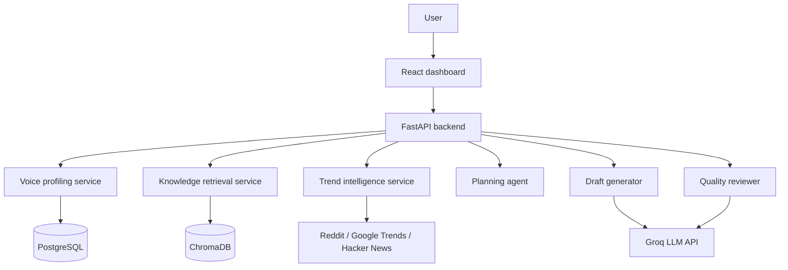

# PersonaPost AI

PersonaPost AI is a project that helps users turn writing samples, reference material, and trending topics into social content drafts that sound like them.

The goal of the project is simple: build something useful, credible, and close to the kind of workflow a product team at Inspire AI would actually need.

## What this project solves

Professionals and founders know their domain but do not always have time to write consistent, high-quality content. Generic AI writers sound robotic, repetitive, and dry. PersonaPost AI addresses that by combining:

- voice learning from user samples
- knowledge retrieval from uploaded documents
- trend discovery from public sources
- draft generation with review and refinement
- a content calendar for planning and reuse

## Core workflow

1. User uploads or pastes writing samples.
2. The backend builds a voice profile from style signals.
3. The system retrieves relevant knowledge and trends.
4. An LLM generates a draft in the user's voice.
5. A reviewer pass checks tone, clarity, and authenticity.
6. The user edits, approves, and saves the post to a simple calendar.

## Architecture



## Tech stack

| Layer | Choice |
|---|---|
| Frontend | React, Vite, Tailwind CSS v3, Framer Motion, Lucide Icons |
| Backend | FastAPI, Pydantic, Pydantic-Settings |
| Database | SQLite (Local Dev) / PostgreSQL (Production) |
| Database Migrations | Alembic |
| Security | Single-user JWT (python-jose + bcrypt), In-tab SessionStorage |
| Rate Limiter | Per-IP sliding-window (10 generation requests/min) |
| Voice Profiling | Lexical metric analytics (sentence construction, pronouns, punctuation) |
| Trend TTL Cache | 5-minute in-memory caching for Hackernews/Reddit |
| Audio Reader | Browser-native Text-To-Speech (SpeechSynthesis API) |
| LLM | Groq API with robust heuristic local fallbacks |
| Deployment | Multi-stage Dockerfiles, Render Blueprints, Vercel SPA redirects |

## Team split

| Area | Ownership |
|---|---|
| Voice learning and retrieval | Voice and retrieval workstream |
| Trend intelligence and generation | Trends and generation workstream |
| Frontend and integration | Frontend and integration workstream |

## Repository layout

```
PersonaPostAi/
├── backend/
│   ├── alembic/
│   │   └── versions/       # Database migrations
│   ├── alembic.ini
│   ├── app/
│   │   ├── middleware/     # Rate limiter middleware
│   │   ├── auth.py         # JWT Token helpers & verify logic
│   │   ├── config.py
│   │   ├── db.py           # Postgres-ready pooling setup
│   │   ├── models.py
│   │   ├── routes.py
│   │   ├── routes_auth.py  # Login and Introspection endpoints
│   │   ├── schemas.py
│   │   └── services/
│   └── tests/              # 74 automated unit and integration tests
├── frontend/
│   └── src/
│       ├── App.jsx         # Dashboard and Login UI
│       ├── lib/api.js      # Session-persisted auth HTTP client
│       └── styles.css      # Premium Shimmer & Glow Styles
├── docs/
├── docker/
│   ├── Dockerfile.backend
│   ├── Dockerfile.frontend
│   ├── nginx.conf
│   └── docker-compose.yml
├── render.yaml             # Render.com deploy blueprint
├── vercel.json             # Vercel deployment configurations
└── README.md
```

## Getting started

### Pre-requisites
* **Python Version:** Python 3.11 or 3.12 is required. Newer versions (e.g. 3.13 or 3.14) will cause build errors with compiled dependencies like `pydantic-core` and SQLAlchemy.
* **Node.js:** Node.js v18 or later.

### Local Setup Steps

```bash
cd PersonaPostAi

# 1. Copy environment variable files
cp backend/.env.example backend/.env
cp frontend/.env.example frontend/.env

# 2. Setup backend virtual environment
cd backend
py -3.12 -m venv .venv
# Activate in Windows PowerShell:
.\.venv\Scripts\Activate.ps1
# Upgrade pip and install dependencies:
.\.venv\Scripts\python.exe -m pip install --upgrade pip
.\.venv\Scripts\python.exe -m pip install -r requirements.txt

# 3. Setup credentials in backend/.env
# Replace the ADMIN_PASSWORD_HASH with your choice or leave default.
# For password "admin123", set:
# ADMIN_PASSWORD_HASH=$2b$12$AhgQiOsvPW.LhuByw/mOSO5jlSCHKWvh8rMFndKkIqXO1ByWld6Ci

# 4. Run database migrations to construct the database schema
alembic upgrade head

# 5. Optionally seed the database with demo listings
python seed_demo.py

# 6. Run all automated verification tests
pytest tests/ -v --tb=short

# 7. Start the backend development server
uvicorn app.main:app --reload --port 8000

# 8. Setup and start the frontend development server
cd ../frontend
npm install
npm run dev
```

### Running with Docker Compose
To launch the full suite (Frontend + Backend + PostgreSQL Database) in containerized mode:

```bash
cd PersonaPostAi/docker
docker compose up --build
```

---

## Detailed Tech implementation Notes

### 1. Custom Voice Profiling & Tokenizer
The system features a suffix-stemming tokenization module in `backend/app/services/knowledge.py`. It strips grammatical suffixes (`-ing`, `-tion`, `-ment`, etc.) from words during retrieval. This allows a search for "automation" to successfully match against "automate", raising Jaccard-similarity match relevance without external libraries.
In addition, `voice.py` runs a dynamic lexical metrics analyzer (averaging sentence lengths, calculating exclamation rates, and evaluating pronoun frequency) to extract custom tone profiles from writing samples.

### 2. Strict JSON Contracts & Parser Security
LLM responses can return malformed JSON or markdown syntax wrappers (` ```json ... ``` `). The backend includes a robust regex stripper `_strip_fences()` inside `generation.py` and `review.py`. This sanitizes LLM markdown containers before passing inputs to `json.loads()`, falling back to deterministic stubs if the output fails validation.

### 3. JWT Security & Sliding-Window Rate Limiting
To harden API endpoints against misuse:
* **Single-User Authorization**: High-mutation and generation endpoints require Bearer Token authorization. Session state is stored in the browser's `sessionStorage`, ensuring authentication persists across tab refreshes but is securely cleared when the window is closed.
* **Sliding-Window Rate Limiter**: Per-IP memory-based sliding window blocks clients exceeding 10 generation requests per minute, responding with status `429` and a header indicating when to try again.

### 4. Trends Cache & AI voice TTS Reader
* **Trends TTL Cache**: To prevent hitting Hacker News and Reddit APIs repeatedly, trend lists are cached in memory for 5 minutes.
* **Text-to-Speech (TTS) Reader**: Users can click **Listen** on generated drafts to hear the post read aloud using browser-native SpeechSynthesis. The speech rates are tuned to the target platform (e.g. fast and punchy for X, slower and professional for LinkedIn).

### 5. Premium-Inspired Frontend UI
The UI is inspired by modern editorial portfolios (e.g. InspireAI and Awwwards-winning layouts):
* **Spotlight Interaction**: Hovering over cards highlights them dynamically relative to the cursor's coordinates.
* **Ambient Glows & Noise Overlay**: Subtle color gradients blur background sections behind a 2.2% opacity SVG noise map.
* **Infinite Ticker**: Double-tracked horizontal ticker detailing the application capabilities.
* **Skeleton Loaders**: Modern shimmers replace raw text elements on all loading states.
* **Toast alerts**: Slide-in success, warning, and error notifications.

---

## Troubleshooting Guide

#### "Fatal error in launcher: Unable to create process"
This occurs if you rename the backend virtual environment folder after creating it (e.g., from `.venv312` to `.venv`). Python virtual environments bake the absolute file path into their executable launchers. 
**Solution:** Delete the `.venv` folder completely and run `py -3.12 -m venv .venv` from scratch.

#### "pydantic-core compile errors on installation"
You are likely using a Python version higher than 3.12 (like 3.13 or 3.14) where pre-compiled wheels for key backend packages are not yet available.
**Solution:** Ensure you use `py -3.12` to construct your virtual environment.

---

## Scope for the internship MVP

This version is intentionally scoped to a two-month internship timeline. The goal is a polished, believable product slice rather than a full production SaaS.

Included:
- voice profile extraction (and merge)
- trend discovery (with TTL caching)
- prompt orchestration (with platform specific rules)
- draft review & retry loop
- content calendar UI & edit history

Not included yet:
- real LinkedIn or X posting integrations
- multi-tenant billing
- automated scheduling jobs

## Documentation

- [Project PRD](docs/PRD.md)
- [Architecture](docs/Architecture.md)
- [Standup notes](docs/Standup.md)
- [Decision log](docs/ADR-001-free-llm-stack.md)

## Status

Current backend slice is operational with:
- Groq-first draft and review pipeline with deterministic fallback mode and auto-retry loops
- single-user JWT OAuth2 token login and introspection
- per-IP sliding-window rate limiting on generation
- persisted voice profiles with dynamic metric extraction and 50/50 merges
- trend fetching with live-source attempts, 5-minute cache, and fallback behaviors
- database schema evolution managed by Alembic migrations
- full backend coverage (74 automated unit and integration tests passing)

Current frontend slice includes:
- JWT login and session persistence across page refreshes
- voice profile creation, trend selection, draft generation, refinement, and calendar views
- inline draft editing and approval persistence
- audio Text-to-Speech draft reading
- toast warnings and skeleton loaders on loading states

