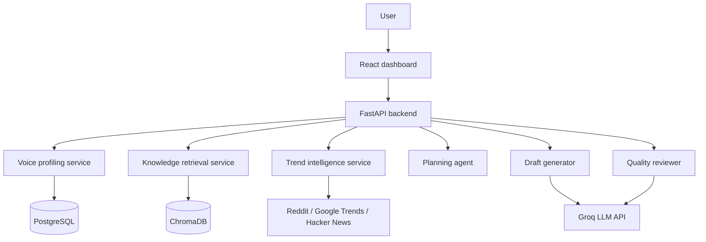

# PersonaPost AI

PersonaPost AI is a project that helps users turn writing samples, reference material, and trending topics into social content drafts that sound like them.

The goal of the project is simple: build something useful, credible, and close to the kind of workflow a product team at Inspire AI would actually need.

## What this project solves

Professionals and founders know their domain but do not always have time to write consistent, high-quality content. PersonaPost AI addresses that by combining:

- voice learning from user samples
- knowledge retrieval from uploaded documents
- trend discovery from public sources
- draft generation with review and refinement
- a content calendar for planning and reuse

## Core workflow

1. User uploads or pastes writing samples.
2. The backend builds a voice profile from style signals.
3. The system retrieves relevant knowledge and trends.
4. An LLM generates a draft in the user's voice.
5. A reviewer pass checks tone, clarity, and authenticity.
6. The user edits, approves, and saves the post to a simple calendar.

## Architecture



## Tech stack

| Layer | Choice |
|---|---|
| Frontend | React, Vite |
| Backend | FastAPI, Pydantic |
| Database | PostgreSQL |
| Vector storage | ChromaDB |
| LLM | Groq API with local fallback |
| Trend sources | Reddit, Google Trends, Hacker News |
| Deployment | Docker Compose |

## Team split

| Area | Ownership |
|---|---|
| Voice learning and retrieval | Voice and retrieval workstream |
| Trend intelligence and generation | Trends and generation workstream |
| Frontend and integration | Frontend and integration workstream |

## Repository layout

```
PersonaPostAi/
├── backend/
├── frontend/
├── docs/
├── docker/
├── scripts/
├── .github/
└── README.md
```

## Getting started

```bash
cd PersonaPostAi

# backend
cd backend
python -m pip install -r requirements.txt
uvicorn app.main:app --reload --port 8000

# frontend
cd ../frontend
npm install
npm run dev
```

Copy the environment example files before running locally:

- `backend/.env.example` to `backend/.env`
- `frontend/.env.example` to `frontend/.env`

## Scope for the internship MVP

This version is intentionally scoped to a two-month internship timeline. The goal is a polished, believable product slice rather than a full production SaaS.

Included:

- voice profile extraction
- trend discovery
- prompt orchestration
- draft review workflow
- content calendar UI

Not included yet:

- real LinkedIn or X posting integrations
- multi-tenant billing
- production-grade analytics
- automated scheduling jobs

## Documentation

- [Project PRD](docs/PRD.md)
- [Architecture](docs/Architecture.md)
- [Standup notes](docs/Standup.md)
- [Decision log](docs/ADR-001-free-llm-stack.md)

## Status

The repository currently contains the project brief, architecture notes, weekly standup format, and the first backend and frontend scaffolding. The next step is to build the first usable feature slice and commit it in small pieces.
