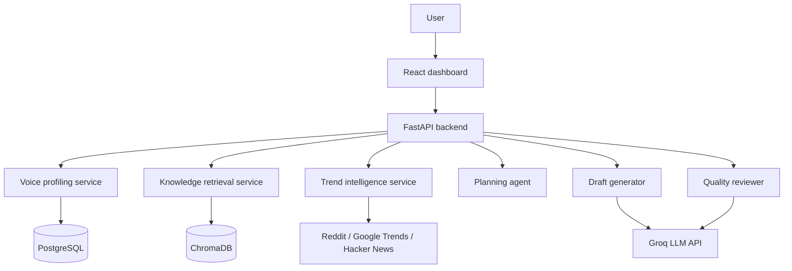

# PersonaPost AI

PersonaPost AI is a project that helps users turn writing samples, reference material, and trending topics into social content drafts that sound like them.

The goal of the project is simple: build something useful, credible, and close to the kind of workflow a product team at Inspire AI would actually need.

## What this project solves

Professionals and founders know their domain but do not always have time to write consistent, high-quality content. Generic AI writers sound robotic, repetitive, and dry. PersonaPost AI addresses that by combining:

- voice learning from user samples
- knowledge retrieval from uploaded documents
- trend discovery from public sources
- draft generation with review and refinement
- a content calendar for planning and reuse

## Core workflow

1. User uploads or pastes writing samples.
2. The backend builds a voice profile from style signals.
3. The system retrieves relevant knowledge and trends.
4. An LLM generates a draft in the user's voice.
5. A reviewer pass checks tone, clarity, and authenticity.
6. The user edits, approves, and saves the post to a simple calendar.

## Architecture



## Tech stack

| Layer | Choice |
|---|---|
| Frontend | React, Vite, Tailwind CSS v3, Framer Motion, Radix UI |
| Backend | FastAPI, Pydantic |
| Database | SQLite (Dev) / PostgreSQL (Prod Containerized) |
| Vector storage | ChromaDB |
| LLM | Groq API with local fallback |
| Trend sources | Reddit, Google Trends, Hacker News |
| Deployment | Docker Compose |

## Team split

| Area | Ownership |
|---|---|
| Voice learning and retrieval | Voice and retrieval workstream |
| Trend intelligence and generation | Trends and generation workstream |
| Frontend and integration | Frontend and integration workstream |

## Repository layout

```
PersonaPostAi/
├── backend/
│   ├── app/
│   │   ├── config.py
│   │   ├── db.py
│   │   ├── models.py
│   │   ├── routes.py
│   │   ├── schemas.py
│   │   └── services/
│   └── tests/
├── frontend/
│   └── src/
│       ├── App.jsx
│       ├── lib/api.js
│       └── styles.css
├── docs/
├── docker/
│   └── docker-compose.yml
└── README.md
```

## Getting started

### Pre-requisites
* **Python Version:** Python 3.11 or 3.12 is required. Newer versions (e.g. 3.13 or 3.14) will cause build errors with compiled dependencies like `pydantic-core` and SQLAlchemy.
* **Node.js:** Node.js v18 or later.

### Local Setup Steps

```bash
cd PersonaPostAi

# 1. Setup backend virtual environment
cd backend
py -3.12 -m venv .venv
# Activate in Windows PowerShell:
.\.venv\Scripts\Activate.ps1
# Upgrade pip and install dependencies:
.\.venv\Scripts\python.exe -m pip install --upgrade pip
.\.venv\Scripts\python.exe -m pip install -r requirements.txt

# Run backend development server
.\.venv\Scripts\python.exe -m uvicorn app.main:app --reload --port 8000

# 2. Setup frontend development server
cd ../frontend
npm install
npm run dev
```

### Running with Docker Compose
To launch the full suite (Frontend + Backend + PostgreSQL Database) in containerized mode:

```bash
cd PersonaPostAi/docker
docker compose up --build
```

Copy the environment example files before running locally:

- `backend/.env.example` to `backend/.env`
- `frontend/.env.example` to `frontend/.env`

---

## Detailed Tech implementation Notes

### 1. Custom Voice Profiling & Tokenizer
The system features a suffix-stemming tokenization module in `backend/app/services/knowledge.py`. It strips grammatical suffixes (`-ing`, `-tion`, `-ment`, etc.) from words during retrieval. This allows a search for "automation" to successfully match against "automate", raising Jaccard-similarity match relevance without external libraries.

### 2. Strict JSON Contracts & Parser Security
LLM responses can return malformed JSON or markdown syntax wrappers (` ```json ... ``` `). The backend includes a robust regex stripper `_strip_fences()` inside `generation.py` and `review.py`. This sanitizes LLM markdown containers before passing inputs to `json.loads()`, falling back to deterministic stubs if the output fails validation.

### 3. Awwwards & Premium-Inspired Frontend UI
The UI is inspired by modern editorial portfolios (e.g. InspireAI and Awwwards-winning layouts):
* **Custom Cursor:** Dot + ring following mouse movements with spring physics using `framer-motion`.
* **Spotlight Interaction:** Hovering over cards highlights them dynamically relative to the cursor's coordinates.
* **Ambient Glows & Noise Overlay:** Subtle color gradients blur background sections behind a 2.2% opacity SVG noise map.
* **Infinite Ticker:** Double-tracked horizontal ticker detailing the application capabilities.

---

## Troubleshooting Guide

#### "Fatal error in launcher: Unable to create process"
This occurs if you rename the backend virtual environment folder after creating it (e.g., from `.venv312` to `.venv`). Python virtual environments bake the absolute file path into their executable launchers. 
**Solution:** Delete the `.venv` folder completely and run `py -3.12 -m venv .venv` from scratch.

#### "pydantic-core compile errors on installation"
You are likely using a Python version higher than 3.12 (like 3.13 or 3.14) where pre-compiled wheels for key backend packages are not yet available.
**Solution:** Ensure you use `py -3.12` to construct your virtual environment.

---

## Scope for the internship MVP

This version is intentionally scoped to a two-month internship timeline. The goal is a polished, believable product slice rather than a full production SaaS.

Included:

- voice profile extraction
- trend discovery
- prompt orchestration
- draft review workflow
- content calendar UI

Not included yet:

- real LinkedIn or X posting integrations
- multi-tenant billing
- production-grade analytics
- automated scheduling jobs

## Documentation

- [Project PRD](docs/PRD.md)
- [Architecture](docs/Architecture.md)
- [Standup notes](docs/Standup.md)
- [Decision log](docs/ADR-001-free-llm-stack.md)

## Status

Current backend slice is operational with:

- Groq-first draft and review pipeline with deterministic fallback mode
- persisted voice profiles and threshold-gated draft approvals
- trend fetching with live-source attempts and fallback behavior
- calendar endpoint backed by persisted entries
- route-level tests for core API flow

Current frontend slice includes:

- API client wrappers for backend endpoints
- voice profile creation, trend selection, draft generation, and calendar views
- persisted-status feedback on draft approval attempts

