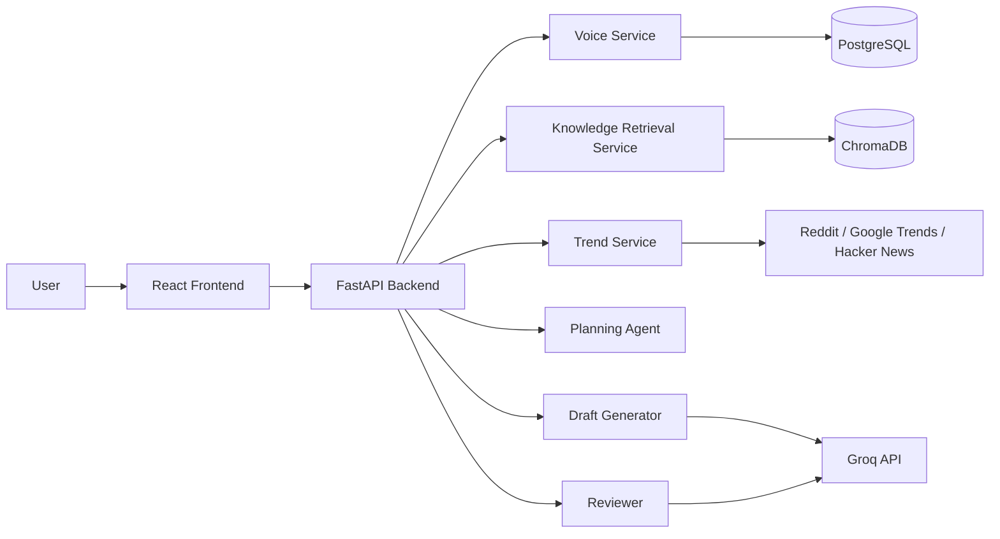

# PersonaPost AI - Architecture

## System overview

PersonaPost AI uses a simple service-oriented layout so the team can work in parallel without stepping on each other’s work.

## Design principles

- keep the first version shippable in 2 months
- avoid paid dependencies where possible
- make every module testable in isolation
- keep the API contracts small and explicit
- allow the product to run in a fallback mode without external keys
- make the repo easy to explain in a demo or interview

## Data flow

1. The frontend sends samples and requests to the backend.
2. The backend extracts a voice profile and stores it.
3. The knowledge service indexes uploaded text for retrieval.
4. The trend service collects candidate topics.
5. The planner chooses a content angle and structure.
6. The generator writes a draft.
7. The reviewer evaluates the draft and requests a refinement when needed.
8. The frontend shows the final draft and saves it into a calendar view.

## Team responsibilities

The work is split by module so each person can own a clearly defined piece of the system.

- Voice and retrieval workstream: style extraction, profile storage, document indexing
- Trends and generation workstream: trend collection, planning, draft creation, review loop
- Frontend and integration workstream: dashboard, API wiring, calendar, polish

## Initial module layout

### Backend

- `app/main.py` - FastAPI app entry point
- `app/api/routes.py` - HTTP routes
- `app/services/voice.py` - voice profile extraction
- `app/services/trends.py` - trend discovery
- `app/services/generation.py` - draft creation and refinement
- `app/services/review.py` - quality checks
- `app/schemas.py` - request and response models

### Frontend

- `src/App.jsx` - dashboard shell
- `src/components/` - reusable cards and panels
- `src/lib/api.js` - backend calls
- `src/styles.css` - design system

## Deployment target

The first runnable version is designed for local development and Docker Compose. Production deployment can be added later without changing the core module boundaries.
