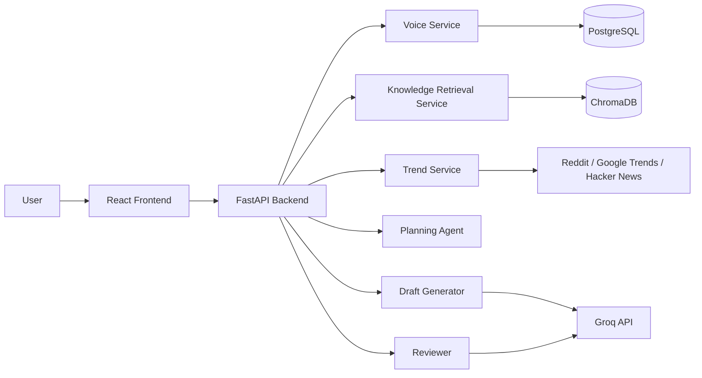
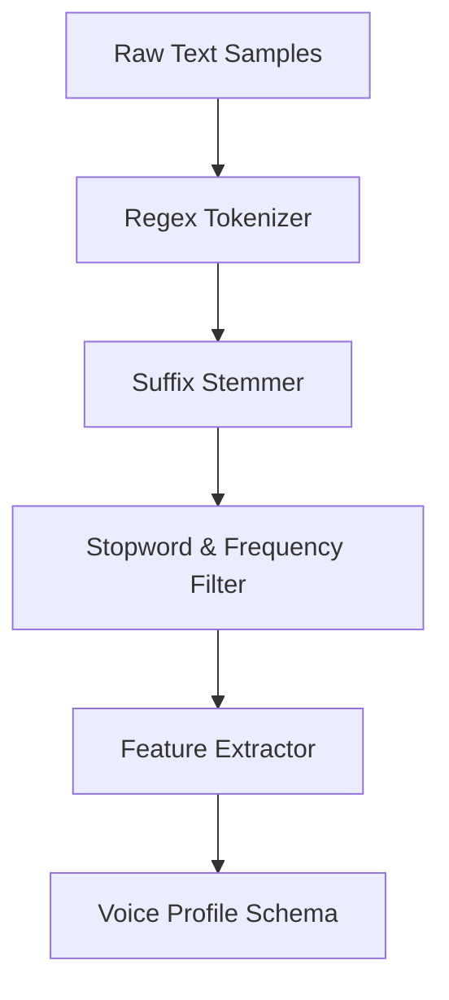
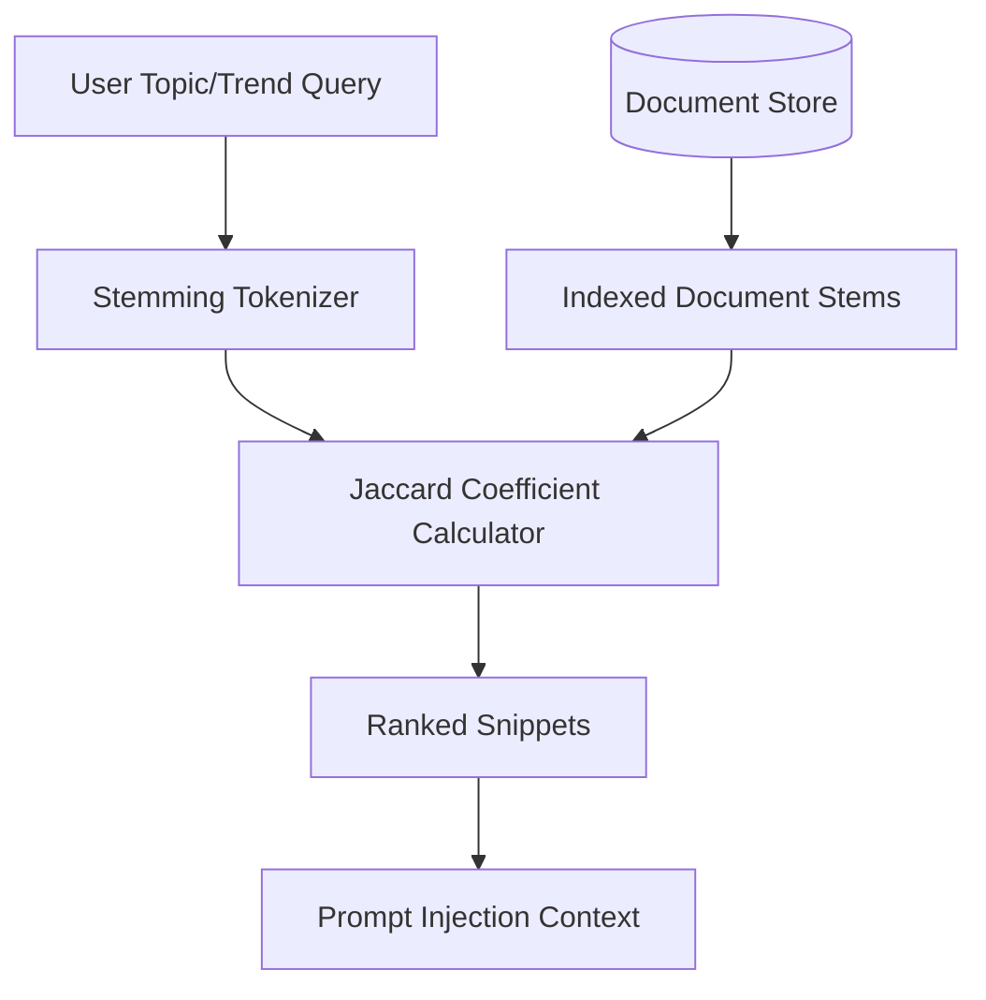
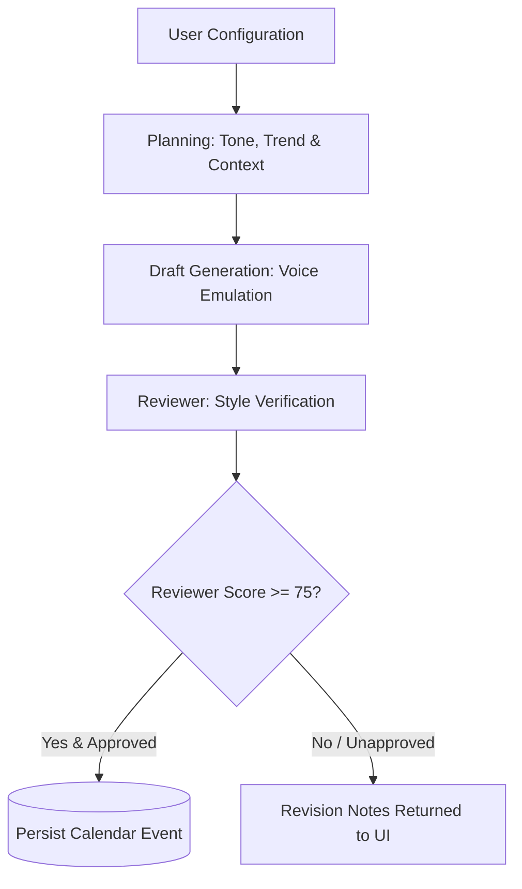
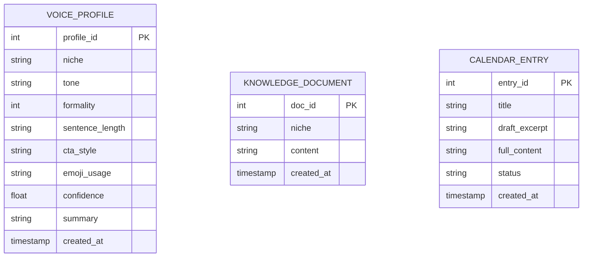

# PersonaPost AI - Architecture

## System overview

PersonaPost AI uses a simple service-oriented layout so the team can work in parallel without stepping on each other’s work.

## Design principles

- keep the first version shippable in 2 months
- avoid paid dependencies where possible
- make every module testable in isolation
- keep the API contracts small and explicit
- allow the product to run in a fallback mode without external keys
- make the repo easy to explain in a demo or interview

## Data flow

1. The frontend sends samples and requests to the backend.
2. The backend extracts a voice profile and stores it.
3. The knowledge service indexes uploaded text for retrieval.
4. The trend service collects candidate topics.
5. The planner chooses a content angle and structure.
6. The generator writes a draft.
7. The reviewer evaluates the draft and requests a refinement when needed.
8. The frontend shows the final draft and saves it into a calendar view.

## Team responsibilities

The work is split by module so each person can own a clearly defined piece of the system.

- Voice and retrieval workstream: style extraction, profile storage, document indexing
- Trends and generation workstream: trend collection, planning, draft creation, review loop
- Frontend and integration workstream: dashboard, API wiring, calendar, polish

## Initial module layout

### Backend

- `app/main.py` - FastAPI app entry point
- `app/routes.py` - HTTP routes
- `app/config.py` - environment and runtime settings
- `app/db.py` - SQLAlchemy engine and session setup
- `app/models.py` - persistence models for profiles, drafts, and calendar entries
- `app/services/voice.py` - voice profile extraction
- `app/services/trends.py` - trend discovery
- `app/services/generation.py` - draft creation and refinement
- `app/services/review.py` - quality checks
- `app/services/persistence.py` - save and read operations for profile, draft, and calendar data
- `app/schemas.py` - request and response models

### Frontend

- `src/App.jsx` - dashboard shell
- `src/components/` - reusable cards and panels
- `src/lib/api.js` - backend calls
- `src/styles.css` - design system

## Deployment target

The first runnable version is designed for local development and Docker Compose. Production deployment can be added later without changing the core module boundaries.

---

## Detailed Pipeline Specifications

### 1. Voice Ingestion & Tokenization Pipeline
The voice extraction engine processes raw text inputs to determine stylistic metrics (formality, tone, sentence construction, CTA placement). It implements a custom suffix-stemming ruleset to achieve high quality overlap scores without external linguistic heavy weights.

#### Stylistic Metrics Formats
* **Formality Score:** An integer rating from 1 (highly conversational, heavy slang) to 10 (strictly academic/analytical).
* **Sentence Length Distribution:** Averaged count of tokens per sentence, categorizing structure into short, medium, or complex periods.
* **Emoji Coefficient:** Ratio of emojis detected per word block.

### 2. Retrieval-Augmented Generation (RAG) Flow
The RAG component uses Jaccard similarity backed by stemming-aware token lists. This guarantees target-match precision when retrieving corporate positioning guidelines or historical templates to inject context into the planning phase.

### 3. Generation, Review & Feedback Loop
All generation sequences implement a structured double-pass validation:
1. **Planning Step:** Synthesizes the core argument, formatting outline, and selected trend relevance.
2. **Drafting Step:** Writes the raw body.
3. **Reviewer Step:** Evaluates style adherence, assigns a score (0-100), and creates revision notes.

### 4. Database Schema Relationships
The local persistence layer relies on two modes: SQLite (`personapost.db`) during development and PostgreSQL when deployed inside Docker Containers.

